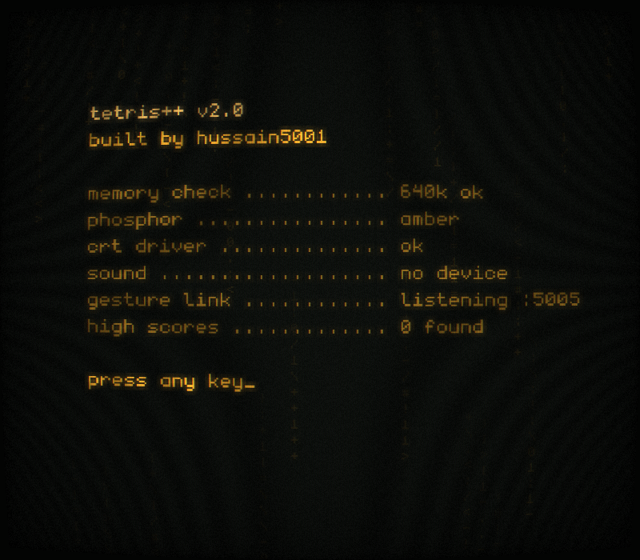
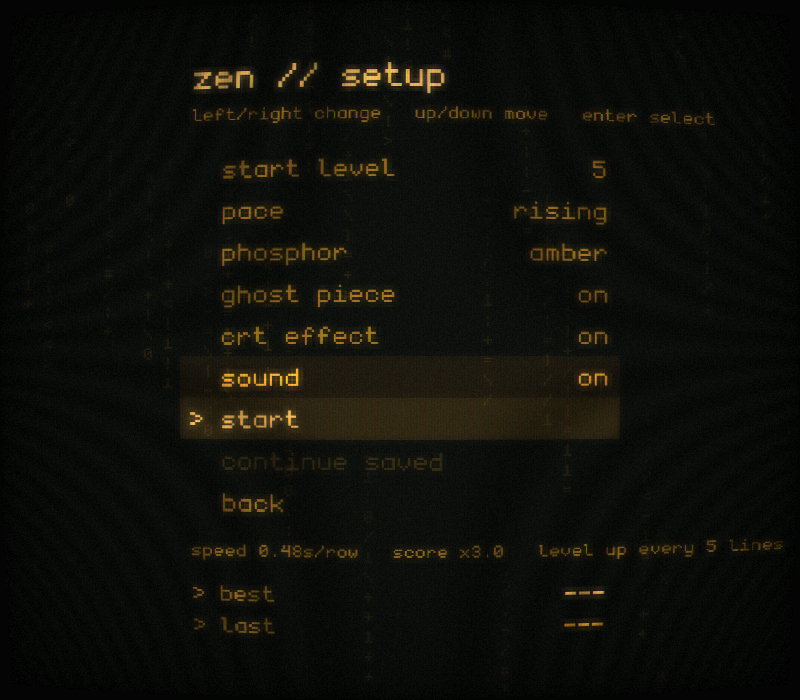

# Tetris++ — hands-free edition

An extended version of **TetrisX**, our university C++ Tetris clone
([Hussain5001/tetris](https://github.com/Hussain5001/tetris)). The original
repository is left untouched; this one adds:

- **A night-terminal look.** Amber or green phosphor on black, shown through a CRT effect with
  curved glass, scanlines and glow. The well is framed with `<! !>` like the 1984 original.
- **Zen levels.** Choose a start level (speed and score multiplier) and a pace (how quickly it
  speeds up), plus quick settings, all remembered between runs.
- **Smoother play.** Lock delay, wall kicks, a sliding block, a 3-2-1 countdown, line-clear
  sparks, a hard-drop trail and generated sound effects.
- **High scores.** The best five results and your last run for every mode, saved to `scores.json`.
- **Hands-free play.** A small Python program watches your webcam, recognises hand
  gestures with MediaPipe and sends them to the game.

| Boot | Menu | Zen setup |
|---|---|---|
|  |  |  |
| **Playing** | **Paused** | **Game over** |
|  |  |  |

## Play on Windows

**Easiest: download the ready-made game, no compilers needed.**

1. Open the repo's [Actions → build](https://github.com/Hussain5001/tetrisPlusPlus/actions/workflows/build.yml)
   page, click the newest green run, and download **TetrisPlusPlus-windows** under *Artifacts*.
   Tagged versions also appear under *Releases*.
2. Unzip it anywhere, for example your Desktop.
3. Double-click **`play.bat`**. For keyboard-only play, double-click `Tetris.exe` instead.

Hand control needs [Python 3.10–3.12](https://www.python.org/downloads/); tick "Add python.exe
to PATH" when installing. On the first start, a minimised "Tetris++ hand control" window installs
MediaPipe (a minute or two). Then the camera preview opens and the game's HAND CONTROL box turns on.

**To change the code on Windows**, clone into a normal Windows folder (not inside WSL) and
use `build.bat`:

```powershell
winget install Git.Git Kitware.CMake
winget install Microsoft.VisualStudio.2022.BuildTools --override "--add Microsoft.VisualStudio.Workload.VCTools --includeRecommended --passive"
git clone --recursive https://github.com/Hussain5001/tetrisPlusPlus.git
cd tetrisPlusPlus
.\build.bat          # builds, then starts the game with hand control
```

Everything runs on one machine that way, so the camera works without the WSL networking steps below.

## Building

```bash
git clone --recursive https://github.com/Hussain5001/tetrisPlusPlus.git
cd tetrisPlusPlus
cmake -B build -DCMAKE_BUILD_TYPE=Release
cmake --build build
./build/Tetris            # Windows: build\Debug\Tetris.exe
```

On Linux you need the X11/OpenGL headers for raylib
(`sudo apt install libx11-dev libxrandr-dev libxinerama-dev libxcursor-dev libxi-dev libgl1-mesa-dev`).

If you cloned without `--recursive`, run `git submodule update --init` first.

## Keyboard controls

| Key | Action |
|---|---|
| ← / → (hold to repeat) | move |
| ↑ or X | rotate |
| ↓ | soft drop |
| Space | hard drop |
| Esc or P | pause (the game also pauses when its window loses focus) |
| Enter | select in menus |
| M | sound on/off |
| F11 | fullscreen |

## Zen setup

Choosing **zen** opens a setup screen. Use ← / → to change a value and ↑ / ↓ to move:

| Setting | What it does |
|---|---|
| start level 1–10 | Starting speed, from 0.80 s per row at level 1 to 0.10 s at level 10. Each level adds ×0.5 to the score multiplier, so level 5 scores ×3. |
| pace | How often you level up: **chill** every 10 lines, **steady** 8, **rising** 5 (the original), **brutal** 3. Past level 10 it keeps speeding up down to 0.05 s per row. |
| phosphor | **amber**, **green**, or **multi** (muted colours per block) |
| ghost piece | Show where the block will land |
| crt effect | The curved-glass/scanline effect; turn it off on slow machines |
| sound | Generated terminal-style beeps |

Choices are saved in `profile.json`. **continue saved** loads a game saved with *save & quit* from the pause menu.

## High scores

Every finished game is saved to `scores.json` straight away: the **top 5** for each mode, plus your
**last run** (even when it isn't a high score). The menu shows the best and last result for the
selected mode, and the game-over screen shows your rank and the table. First 40 Lines ranks by the
fastest time and only counts games where you actually cleared 40 lines.

## Hands-free play (camera gestures)

```bash
pip install -r gesture/requirements.txt      # mediapipe + opencv (Python 3.9-3.12)
./build/Tetris --gestures                    # starts the game and the camera script
# or run them separately:
./build/Tetris
python3 gesture/hand_control.py              # add --mode position to try position mode
```

The first run downloads the MediaPipe hand model (about 8 MB) to `gesture/models/`.
The "HAND CONTROL" box in the game turns green when the camera script is connected,
and every recognised gesture is shown briefly over the board.

| Gesture | In game | In menus |
|---|---|---|
| Swipe left / right | move one column | move the selection |
| Swipe down | hard drop | select |
| Swipe up **or** pinch (thumb and index finger) | rotate | move the selection up |
| Hold a fist for about half a second | pause | select |

**Position mode** (`--mode position`, or press `m` in the camera window): the falling
piece follows your hand sideways. It's faster than swiping for quick play; swipe down still drops.

Tips for responsive play:

- Swipes fire as soon as your hand speeds up, not when the movement ends. A short, quick
  flick works better than a long sweep.
- Bringing your hand back after a swipe is ignored, so you don't need to "reset" slowly.
- Speeds are measured relative to the size of your hand, so it works at any distance.
- Tuning: `--sensitivity 1.3` makes smaller swipes count, `--sensitivity 0.8` needs bigger
  ones, and `--no-vertical` turns off up/down swipes. Thresholds are in `gesture/gestures.py` (`Config`).
- Good lighting and a plain background help MediaPipe the most.

### Playing from WSL

The native Windows version above is simpler. Use this only if you want to keep playing in WSL.


WSL2 can't access your laptop's webcam (`Could not open camera/video: 0`). The game can stay
in WSL, but the hand tracking has to run on Windows. It sends gestures to the game over the network.

**Automatic:** `./build/Tetris --gestures` detects WSL and starts `gesture\run_windows.bat`
on Windows for you. You need Python 3.10–3.12 installed on Windows
([python.org](https://www.python.org/downloads/)). The first start sets up a Python environment
in `%LOCALAPPDATA%\tetrisplusplus` and installs MediaPipe, which takes a minute.

**Manual**, if you prefer to start it yourself:

- *Windows 11 with mirrored networking* (Windows and WSL share `localhost`). Add this to
  `%UserProfile%\.wslconfig`, run `wsl --shutdown`, then reopen WSL:
  ```ini
  [wsl2]
  networkingMode=mirrored
  ```
  Start `./build/Tetris` in WSL, then double-click `gesture\run_windows.bat` on Windows. From
  WSL, `explorer.exe gesture` opens that folder.
- *Default (NAT) networking*: start the game with `./build/Tetris --gesture-bind 0.0.0.0`, get
  the WSL address with `hostname -I` (first address), then on Windows run
  `gesture\run_windows.bat --host <that address>`.

The camera preview window opens on Windows. The game's "HAND CONTROL" box turns green once gestures arrive.

### How it works

```
webcam ──► hand_control.py ──(UDP 127.0.0.1:5005, e.g. "L", "H", "@4")──► Tetris
           MediaPipe landmarks                                            InputManager
           → gestures.py                                                  → Game::apply(Action)
```

The game reads the UDP socket without blocking every frame, so a gesture takes effect on
the next frame after it arrives. You can also drive the game from any other program or
script that sends these commands:

```bash
echo -n R | nc -u -w0 127.0.0.1 5005     # move right
```

## Tests

```bash
./build/Tetris --test                          # C++ unit tests (board, tetrominoes, modes)
python3 -m unittest gesture/test_gestures.py   # gesture detector with synthetic hands
```

## Credits

Original TetrisX team: Hussain Shakir, Manav Bijlani, Riddhi Agarwal and aryapranjan.
Built with [raylib](https://www.raylib.com/), [nlohmann/json](https://github.com/nlohmann/json)
and [MediaPipe](https://developers.google.com/mediapipe). Font: *monogram* by datagoblin (CC0).
See [User_Documentation.md](User_Documentation.md) for the game modes and scoring.
